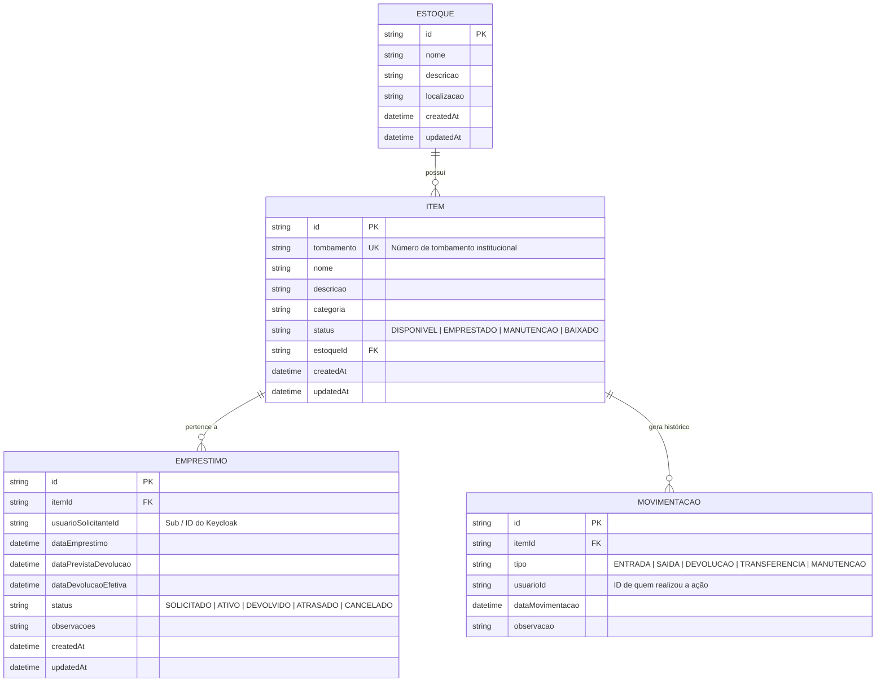

# Modelagem de Entidades e Contratos da API

## 1. Diagrama de Entidades e Relacionamentos (ERD)



---

## 2. Contratos da API (Endpoints e Payloads)

Prefixo base da API: `/controle-estoque-emprestimos/api/v1`

### 📦 Módulo de Estoques
* **`GET /estoques`** — Lista todos os estoques cadastrados.
* **`POST /estoques`** — Cria um novo estoque.
  ```json
  {
    "nome": "Almoxarifado Central CIn",
    "descricao": "Estoque de periféricos e equipamentos gerais",
    "localizacao": "Bloco A - Sala 12"
  }
  ```

### 🏷️ Módulo de Itens
* **`GET /itens`** — Lista itens (suporta filtros `?status=DISPONIVEL` ou `?tombamento=123`).
* **`POST /itens`** — Cadastra um novo item com tombamento.
  ```json
  {
    "tombamento": "UFPE-2026-0981",
    "nome": "Notebook Dell Latitude 3420",
    "descricao": "i7 16GB RAM 512GB SSD",
    "categoria": "Informatica",
    "estoqueId": "uuid-do-estoque"
  }
  ```
* **`GET /itens/:id`** — Detalhes do item e seu histórico.

### 🔄 Módulo de Empréstimos
* **`GET /emprestimos`** — Lista empréstimos (filtros por `status` ou `usuarioSolicitanteId`).
* **`POST /emprestimos`** — Registra a saída de um item para empréstimo.
  ```json
  {
    "itemId": "uuid-do-item",
    "usuarioSolicitanteId": "sub-do-keycloak",
    "dataPrevistaDevolucao": "2026-10-15T18:00:00.000Z",
    "observacoes": "Retirado para projeto de pesquisa"
  }
  ```
* **`PATCH /emprestimos/:id/devolucao`** — Finaliza o empréstimo (devolução do item).
  ```json
  {
    "observacoes": "Devolvido em perfeito estado"
  }
  ```

### 📜 Módulo de Movimentações
* **`GET /movimentacoes`** — Consulta o log auditável de movimentações.
* **`POST /movimentacoes`** — Registra manualmente uma entrada/saída ou transferência.
  ```json
  {
    "itemId": "uuid-do-item",
    "tipo": "MANUTENCAO",
    "observacao": "Enviado para reparo de tela"
  }
  ```